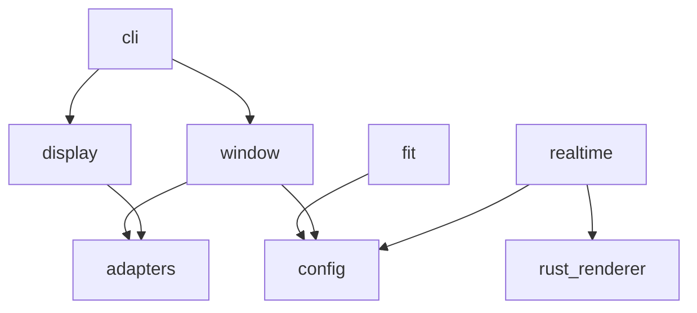

# ARCHITECTURE.md — 設計方針

プロジェクタ投影用 Python ライブラリの設計メモ。初期実装では Python 3.12 + uv、`ProjectionWindow` API、pygame / SDL backend を採用した。リアルタイムフレーム投影は Rust / wgpu renderer へ切り替える。

## Design Goals

- Python から画像・映像の投影を呼び出せる。
- 投影ウィンドウの位置、サイズ、対象ディスプレイ、フルスクリーン表示を明示できる。
- GUI / レンダリングバックエンドを後から差し替えられる。
- GPU がある PC では GPU を使ってリアルタイムフレームを投影できる。
- 現場ごとの投影条件を記録し、再現しやすくする。
- 最初は小さく実装し、プロジェクションマッピングや補正は必要になってから拡張する。

## Constraints

- 静止画・テストパターン用の公開 API は `ProjectionWindow` を入口に小さく始める。
- リアルタイムフレーム投影の公開 API は `RealtimeProjection` を入口にする。
- 初期 backend は pygame / SDL。高頻度フレーム投影は Rust / wgpu renderer に分離する。
- Windows 環境での利用を当面の主対象にするが、OS 固有処理は可能な範囲で adapter に隔離する。
- 大容量の画像・動画素材はリポジトリに含めない。

## Architectural Style

初期方針は「小さなレイヤード構成 + adapter 境界」。プロジェクタ制御では GUI / 動画再生ライブラリの差し替え可能性が重要なので、核となる設定・状態・API と、バックエンド固有処理を分ける。

```text
user code / examples
        |
public API facade
        |
projection window facade
        |
config / fit calculation
        |
backend adapters
        |
OS / window system / media library
```

リアルタイム投影は Rust renderer process を別に持つ。

```text
Python frame producer
        |
RealtimeProjection facade
        |
TCP frame protocol (copy-based MVP)
        |
Rust renderer process
        |
winit window + wgpu device + shader
        |
GPU / display
```

## Public API Decision

| 案 | 概要 | 長所 | 短所 |
|----|------|------|------|
| A | 関数ベース: `show_image(path, fullscreen=True)` | 最初に使いやすい | 状態管理や連続再生が複雑になる |
| B | ウィンドウオブジェクト: `ProjectionWindow(...).show_image(...)` | ウィンドウ位置、フルスクリーン、再利用を表現しやすい | 初期 API が少し重くなる |
| C | 設定ファイル中心: `run_projection(config)` | 現場設定の再現性が高い | 小さなスクリプトからは回りくどい |

採用案は B。理由は、ユーザー要件の「ウィンドウの場所」「フルスクリーン」を状態として自然に持てるため。設定ファイル中心の入口は、現場設定を共有したくなった段階で追加する。

## Backend Decision

| 案 | 概要 | 向いていること | 注意点 |
|----|------|------|------|
| A | OpenCV 系 | 静止画表示や簡単な動画処理 | マルチディスプレイや UI 制御は検証が必要 |
| B | SDL / pygame 系 | フルスクリーン、ディスプレイ選択、イベント処理 | 高度な動画再生は別途検討が必要 |
| C | Qt / PySide 系 | ウィンドウ制御、UI、動画表示をまとめやすい | 依存が重くなりやすい |
| D | Web / browser 系 | HTML / CSS / video を使える | Python だけで完結しにくい |
| E | Rust / wgpu 系 | GPU を使うリアルタイムフレーム投影、shader 補正 | Rust 実装と Python 連携が必要 |

静止画・テストパターンの MVP は B を採用済み。display 指定、fullscreen、DPI 対応は実機検証済み。
リアルタイムフレーム投影は E を採用する。Rust renderer が window / event loop / GPU device を所有し、Python はフレーム投入と制御に限定する。

## Planned Module Map

現在の実装構成。

| モジュール | 責務 | 依存してよい先 |
|------|------|------|
| `projector_controller.window` | `ProjectionWindow` 公開 API | `config`, backend adapter |
| `projector_controller.realtime` | `RealtimeProjection` 公開 API、Rust renderer process 起動、frame IPC | `config`, Rust renderer binary |
| `projector_controller.config` | 表示設定、ウィンドウ設定、値オブジェクト | なし |
| `projector_controller.fit` | `contain` / `cover` / `stretch` / `native` の配置計算 | `config` |
| `projector_controller.display` | ディスプレイ一覧の取得 | `config`, backend adapter |
| `projector_controller.adapters` | GUI / 動画再生バックエンド固有処理 | 外部ライブラリ |
| `projector_controller.cli` | 手動検証用 CLI | `window`, `display`, `config` |
| `crates/projector-controller-renderer` | Rust / wgpu renderer binary | `winit`, `wgpu` |



## Dependency Rules

- `config` と `fit` は外部 GUI ライブラリに依存しない。
- バックエンド固有処理は `adapters` に閉じ込める。
- 公開 API は adapter の具体クラスを直接露出しない。
- OS ごとの分岐は小さくまとめ、テスト可能な純粋ロジックと分離する。
- 大きな抽象は、同じ分岐や重複が実際に 3 回程度出てから導入する。

## Key Data Concepts

- `DisplaySpec`: ディスプレイ番号、名前、原点座標、解像度、スケールなど。
- `WindowGeometry`: ウィンドウ左上座標、幅、高さ（位置＋サイズをまとめた値。`geometry=` 引数や fit 計算で使う）。
- `Point` / `Size`: ウィンドウの絶対座標と画素サイズ。`ProjectionConfig` は `position`（`None`=中央）と `size` を保持する。
- `ProjectionConfig`: フルスクリーン、対象ディスプレイ、位置、サイズ、背景色、fit mode など。
- `FitMode`: `contain`, `cover`, `stretch`, `native` などの表示方法。
- `MediaSource`: 静止画、動画、生成フレームなどの入力。
- `RealtimeProjection`: Rust renderer process を制御し、`submit_frame` で frame を投入する Python facade。
- `Frame`: `RGBA8` / `BGRA8` の連続メモリ、width / height / pixel format / fit mode を持つリアルタイム入力。

## Rust Realtime Renderer（決定済み: 2026-05-31）

リアルタイムフレーム投影は Rust renderer binary が担当する。

- Rust renderer は `winit` で window / monitor / fullscreen を管理する。
- GPU 描画は `wgpu` を使う。`wgpu` は Windows では D3D12 / Vulkan / OpenGL などの backend を選べる。
- Python 側は `RealtimeProjection` から renderer process を起動し、localhost TCP で frame を送る。
- 初期 protocol は copy-based。`RGBA8` / `BGRA8` の `width * height * 4` bytes を frame ごとに送る。
- Rust 側は GPU texture を再利用し、frame 到着ごとに texture upload して fullscreen quad で描画する。
- `contain` / `cover` / `stretch` / `native` は Rust 側で quad 頂点を更新して適用する。

理由: Python process 内で GUI event loop と GPU device を握るより、Rust renderer process に分離した方が GIL と Python 側のスケジューリング影響を受けにくい。将来 shared memory / ring buffer へ移す場合も、frame sink の境界が明確になる。

## Window Placement（決定済み: 2026-05-31）

ウィンドウの表示位置は `position`（左上座標）と `size`（幅・高さ）で表す。

- **原点はデスクトップ全体の左上（絶対座標）**。OS のマルチモニタ原点をそのまま使う。
- `position` を **省略（`None`）** すると、backend が **対象 `display` の中央**にウィンドウを開く。
- `position` を **指定** すると、その**絶対座標**にウィンドウを開く（`display` 指定よりも座標が優先される）。
- `fullscreen=True` のときは `position` を無視し、`display` 全体を覆う。

理由: pygame 2.6.1 (classic / SDL 2.28.4) の公開 API には各ディスプレイの原点を返す関数がない
（`get_desktop_rects` も `_sdl2.video.get_displays` も非搭載）。そのため「ディスプレイ相対座標」を
正しく実装するには ctypes で SDL を直叩きする必要があり、「小さく始める」方針に反する。絶対座標 +
`display` 中央デフォルトなら追加依存なしで堅牢に実装できる。ディスプレイ相対座標が必要になった段階で
別途検討する（pygame-ce への移行 or ctypes）。

CLI 対応: `--x/--y` を省略すると `--display` の中央、指定すると絶対座標。

## DPI スケーリング（Windows）

Windows の表示スケーリング（例: 200%）が有効だと、DPI 非対応プロセスでは SDL が
**論理サイズ**（物理の縮小値。例: 2880x1800 → 1440x900）しか見えず、ウィンドウや
fullscreen が意図しない大きさになる。これを避けるため、pygame backend は SDL 初期化前に
`SDL_WINDOWS_DPI_AWARENESS=permonitorv2` を設定し、**物理ピクセル**で扱う
（`os.environ.setdefault` なので利用者が上書き可能。非 Windows では無視される）。

診断方法: `pygame.display.get_desktop_sizes()` の値 × OS のスケール = 物理解像度
（`Get-CimInstance Win32_VideoController`）になっていれば DPI 非対応で論理値を見ている。

## Fullscreen 方式

`fullscreen=True` は `pygame.FULLSCREEN` を使い、`set_mode((0, 0), ...)` で対象 display
全体を覆う。DPI 対応により、この (0,0) が選ぶサイズは論理値ではなく**物理解像度**になる。
（`borderless=True` は別フラグで、枠なしウィンドウを指定サイズで開く用途。）

Rust renderer の `fullscreen=True` は `winit` の borderless fullscreen を使う。pygame backend と
実装方式が異なるため、Rust renderer の display 番号・fullscreen・座標挙動は別途実機検証する。

## Configuration Options（未確定）

| 案 | 概要 | 長所 | 短所 |
|----|------|------|------|
| A | Python の dataclass / dict だけ | すぐ使える | 現場設定をファイルで共有しにくい |
| B | TOML / YAML などの設定ファイル | 再現性が高い | パーサ依存とスキーマ管理が必要 |
| C | Python API + 任意で設定ファイル | 小さく始めて拡張しやすい | 2 系統の整合性管理が必要 |

初期実装では Python API と dataclass を採用する。設定ファイルは、現場設定を共有する必要が出た段階で TOML などを比較して導入する。

## Testing Strategy

- 設定や座標計算は純粋関数として単体テストする。
- GUI バックエンドは adapter 単位で薄くし、可能ならモックでテストする。
- Rust renderer は `cargo fmt` / `cargo clippy` / `cargo test` / `cargo check` で検証する。
- Python wrapper は renderer command と frame protocol の純粋部分を単体テストする。
- 実機プロジェクタやマルチディスプレイでしか検証できない内容は `docs/EXPERIMENTS.md` に記録する。
- フルスクリーン、ウィンドウ位置、ディスプレイ選択は OS / 環境差が大きいため、手動検証ログを残す。

## Open Decisions

- 設定ファイル形式を導入するか、導入するならどの形式にするか。
- Rust renderer の frame IPC を shared memory / ring buffer に進めるか。
- 動画デコードと音声同期をどのレイヤで扱うか。
- プロジェクションマッピングや台形補正をいつ扱うか。
- ディスプレイ相対座標の指定（現状は絶対座標のみ。必要なら pygame-ce 移行か ctypes で対応）。
