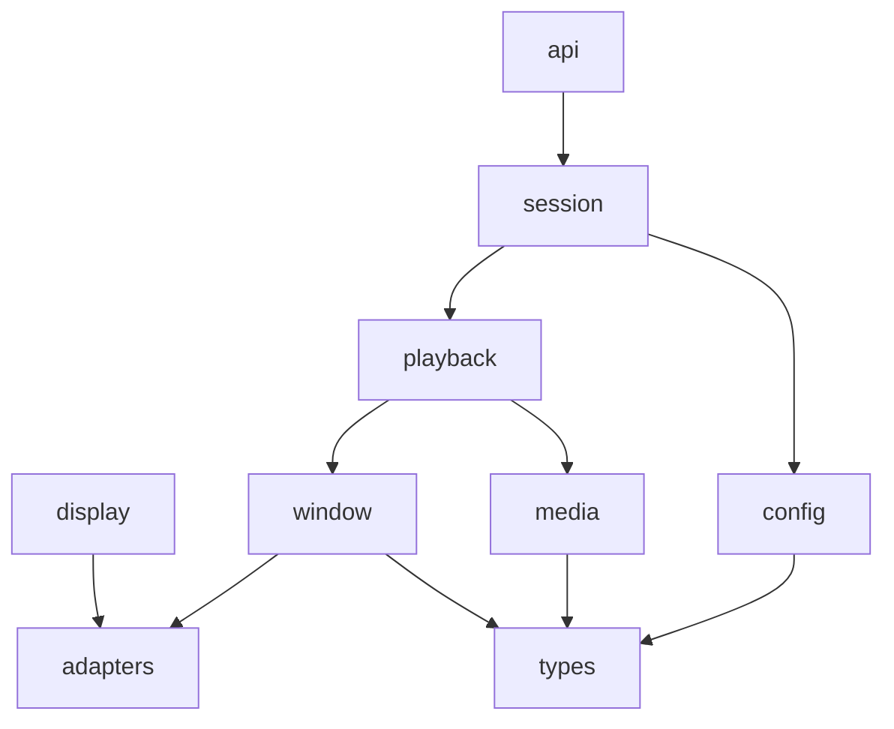

# ARCHITECTURE.md — 設計方針

プロジェクタ投影用 Python ライブラリの設計メモ。ここでは候補と境界を整理し、公開 API、依存ライブラリ、設定形式などの確定は人間確認後に行う。

## Design Goals

- Python から画像・映像の投影を呼び出せる。
- 投影ウィンドウの位置、サイズ、対象ディスプレイ、フルスクリーン表示を明示できる。
- GUI / 動画再生バックエンドを後から差し替えられる。
- 現場ごとの投影条件を記録し、再現しやすくする。
- 最初は小さく実装し、プロジェクションマッピングや補正は必要になってから拡張する。

## Constraints

- 公開 API はまだ未確定。
- 依存ライブラリはまだ未確定。新規依存を追加する前に人間確認が必要。
- Windows 環境での利用を当面の主対象にするが、OS 固有処理は可能な範囲で adapter に隔離する。
- 大容量の画像・動画素材はリポジトリに含めない。

## Architectural Style

初期方針は「小さなレイヤード構成 + adapter 境界」。プロジェクタ制御では GUI / 動画再生ライブラリの差し替え可能性が重要なので、核となる設定・状態・API と、バックエンド固有処理を分ける。

```text
user code / examples
        |
public API facade
        |
projection session / playback orchestration
        |
core types  ---- media loading
        |
backend adapters
        |
OS / window system / media library
```

## Public API Options（未確定）

| 案 | 概要 | 長所 | 短所 |
|----|------|------|------|
| A | 関数ベース: `show_image(path, fullscreen=True)` | 最初に使いやすい | 状態管理や連続再生が複雑になる |
| B | ウィンドウオブジェクト: `ProjectionWindow(...).show_image(...)` | ウィンドウ位置、フルスクリーン、再利用を表現しやすい | 初期 API が少し重くなる |
| C | 設定ファイル中心: `run_projection(config)` | 現場設定の再現性が高い | 小さなスクリプトからは回りくどい |

現時点の推奨候補は B。理由は、ユーザー要件の「ウィンドウの場所」「フルスクリーン」を状態として自然に持てるため。ただし公開 API として確定する前に人間確認が必要。

## Backend Options（未確定）

| 案 | 概要 | 向いていること | 注意点 |
|----|------|------|------|
| A | OpenCV 系 | 静止画表示や簡単な動画処理 | マルチディスプレイや UI 制御は検証が必要 |
| B | SDL / pygame 系 | フルスクリーン、ディスプレイ選択、イベント処理 | 高度な動画再生は別途検討が必要 |
| C | Qt / PySide 系 | ウィンドウ制御、UI、動画表示をまとめやすい | 依存が重くなりやすい |
| D | Web / browser 系 | HTML / CSS / video を使える | Python だけで完結しにくい |

バックエンドは adapter に閉じ込め、公開 API から直接依存させない。

## Planned Module Map

実装開始時の候補。確定ではなく、最初の実装前に見直す。

| モジュール | 責務 | 依存してよい先 |
|------|------|------|
| `projector_controller.api` | 公開 API の薄い入口 | `session`, `config`, `types` |
| `projector_controller.config` | 表示設定、ウィンドウ設定、入力設定 | `types` |
| `projector_controller.types` | `DisplaySpec`, `WindowGeometry`, `FitMode` などの値オブジェクト | なし |
| `projector_controller.display` | ディスプレイ一覧、座標、解像度の取得 | `types`, backend adapter |
| `projector_controller.window` | 投影ウィンドウの生成、位置指定、フルスクリーン制御 | `types`, backend adapter |
| `projector_controller.media` | 画像・動画入力の判定、読み込み補助 | `types` |
| `projector_controller.playback` | 静止画表示、動画再生、プレイリストなどの進行管理 | `window`, `media`, `config` |
| `projector_controller.adapters` | GUI / 動画再生バックエンド固有処理 | 外部ライブラリ |
| `projector_controller.cli` | 将来のコマンドライン入口 | `api`, `config` |



## Dependency Rules

- `types` と `config` は外部 GUI ライブラリに依存しない。
- バックエンド固有処理は `adapters` に閉じ込める。
- 公開 API は adapter の具体クラスを直接露出しない。
- OS ごとの分岐は小さくまとめ、テスト可能な純粋ロジックと分離する。
- 大きな抽象は、同じ分岐や重複が実際に 3 回程度出てから導入する。

## Key Data Concepts

- `DisplaySpec`: ディスプレイ番号、名前、原点座標、解像度、スケールなど。
- `WindowGeometry`: ウィンドウ左上座標、幅、高さ。
- `ProjectionConfig`: フルスクリーン、対象ディスプレイ、背景色、表示倍率など。
- `FitMode`: `contain`, `cover`, `stretch`, `native` などの表示方法。
- `MediaSource`: 静止画、動画、生成フレームなどの入力。

## Configuration Options（未確定）

| 案 | 概要 | 長所 | 短所 |
|----|------|------|------|
| A | Python の dataclass / dict だけ | すぐ使える | 現場設定をファイルで共有しにくい |
| B | TOML / YAML などの設定ファイル | 再現性が高い | パーサ依存とスキーマ管理が必要 |
| C | Python API + 任意で設定ファイル | 小さく始めて拡張しやすい | 2 系統の整合性管理が必要 |

現時点の推奨候補は C。ただしファイル形式と依存は未確定。

## Testing Strategy

- 設定や座標計算は純粋関数として単体テストする。
- GUI バックエンドは adapter 単位で薄くし、可能ならモックでテストする。
- 実機プロジェクタやマルチディスプレイでしか検証できない内容は `docs/EXPERIMENTS.md` に記録する。
- フルスクリーン、ウィンドウ位置、ディスプレイ選択は OS / 環境差が大きいため、手動検証ログを残す。

## Open Decisions

- 最初に採用する GUI / 動画再生バックエンド。
- 最初の公開 API 形状。
- Python バージョンと依存管理方式。
- 設定ファイル形式を導入するか、導入するならどの形式にするか。
- プロジェクションマッピングや台形補正をいつ扱うか。
